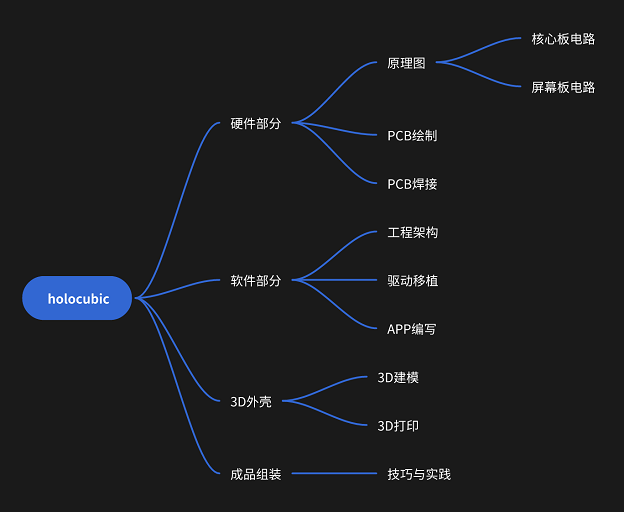
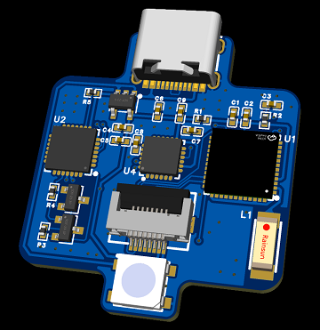
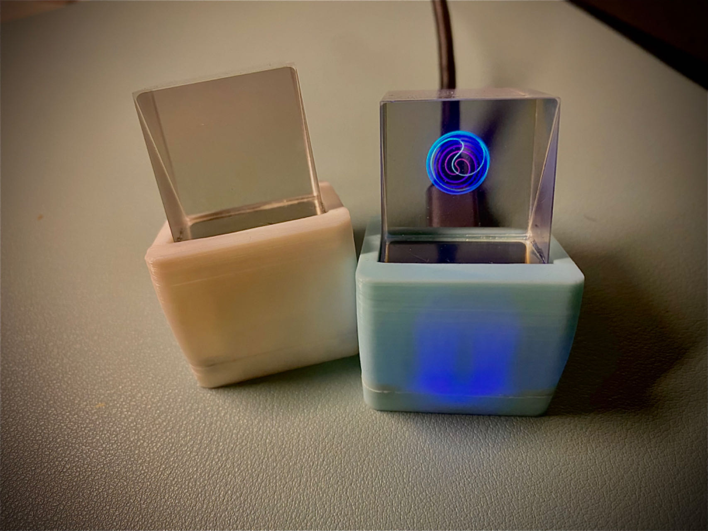
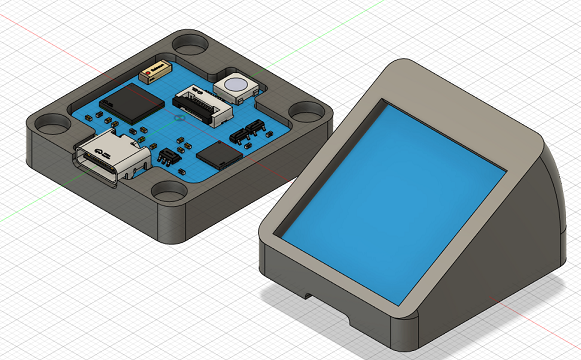

# Holocubic Reproduce
---
**复刻holocubic学习指南**  

参考工程：[大佬的原项目工程](https://github.com/peng-zhihui/HoloCubic)  
博主基本也是从0到1学习实践的，所以记录学习过程，大家一起学习  
学习思路：按照以下教程完成 *硬件学习* -> *软件学习* -> *外壳制作*  
[B站视频](https://www.bilibili.com/video/BV1hN4y1h719/?share_source=copy_web&vd_source=aa112a1eb5d)  

## 效果展示
---
PCB-3D图  
  
主板图  
  
成品展示图  

## 硬件部分
---  
硬件部分已经上传到[立创开源广场](https://oshwhub.com/will.wan/holocubic)

## 软件部分
---
参考本项目

## 外壳部分
---
外壳3D模型文件在[3DShell](./3DShell)文件夹下  

## 内容分享
---
**知乎板块**：  
[Holocubic复刻之路-序言](https://zhuanlan.zhihu.com/p/667687467)  
[Holocubic复刻之路-原理篇](https://zhuanlan.zhihu.com/p/668107235)  
[Holocubic复刻之路-硬件篇-电路原理图](https://zhuanlan.zhihu.com/p/668943131)  
[Holocubic复刻之路-硬件篇-PCB绘制](https://zhuanlan.zhihu.com/p/669356547)  
[Holocubic复刻之路-硬件篇-PCB焊接](https://zhuanlan.zhihu.com/p/669744283)  
[Holocubic复刻之路-软件篇-工程架构](https://zhuanlan.zhihu.com/p/670184699)  
[Holocubic复刻之路-软件篇-驱动移植](https://zhuanlan.zhihu.com/p/670385330)  
[Holocubic复刻之路-软件篇-APP编写](https://zhuanlan.zhihu.com/p/670804613)  
[Holocubic复刻之路-外壳篇-3D打印](https://zhuanlan.zhihu.com/p/671441116)  
[Holocubic复刻之路-组装完结篇](https://zhuanlan.zhihu.com/p/672671669)  

**微信公众号板块**：  
[Holocubic复刻之路-序言](https://mp.weixin.qq.com/s/g9OoGMnk5hJdyEyZY1zoVg)  
[Holocubic复刻之路-原理篇](https://mp.weixin.qq.com/s/hCcCmEE-HVDEflkmTs4eXQ)  
[Holocubic复刻之路-硬件篇-电路原理图](https://mp.weixin.qq.com/s/9BZ2hZZiAkcib54U-MHgQA)  
[Holocubic复刻之路-硬件篇-PCB绘制](https://mp.weixin.qq.com/s/UG-cqXRy1sHwRkdve2HKiw)  
[Holocubic复刻之路-硬件篇-PCB焊接](https://mp.weixin.qq.com/s/iGqCdDKC1GpauwrAINV9UA)  
[Holocubic复刻之路-软件篇-工程架构](https://mp.weixin.qq.com/s/_jIpUm0_Vr3VP4WGBFgyiw)  
[Holocubic复刻之路-软件篇-驱动移植](https://mp.weixin.qq.com/s/LPaq20nl86-nybf8BDHKPg)  
[Holocubic复刻之路-软件篇-APP编写](https://mp.weixin.qq.com/s/clkCv0ckISnppMRNjqzFOA)  
[Holocubic复刻之路-外壳篇-3D打印](https://mp.weixin.qq.com/s/eF_fNTJvMFr8hR-gaSXPrQ)  
[Holocubic复刻之路-组装完结篇](https://mp.weixin.qq.com/s/OH6-Obgg1hRzLUqWNXFC6w)  

## 致谢
[原作者](https://github.com/peng-zhihui/HoloCubic)  
博文中提及的所有参考资料贡献者

---

公众号同步更新，请关注 **硅基ROBOT**  
